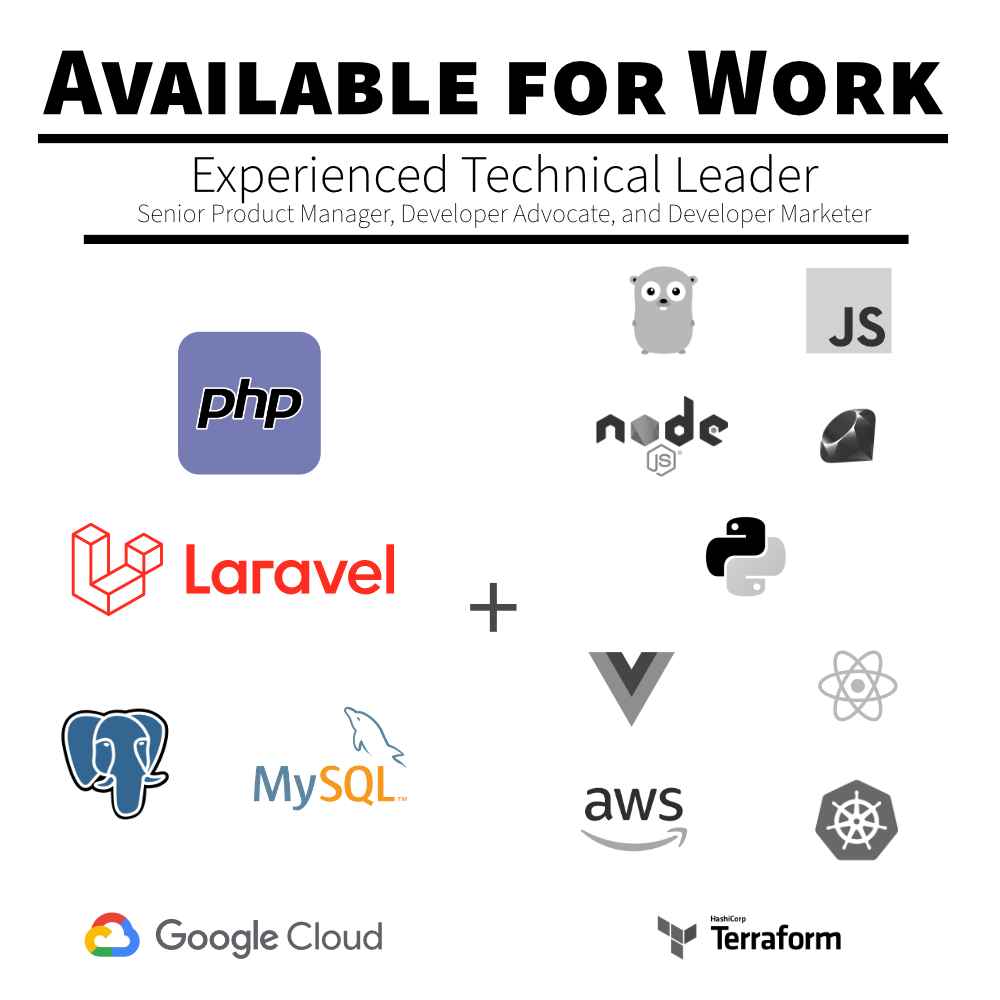

  

## Hi, I'm Davey

You might know me from projects such as [PHP Internals](https://github.com/php/php-src), the [PHP 7+ MySQL Shim](https://github.com/dshafik/php7-mysql-shim), or most recently [Bag: Immutable Values Objects for PHP (and Laravel)](https://bagvalueobjects.com).

  
  

### About Me

I have spent twenty years writing professional self-bios which has — obviously — left me completely unequipped to write this document. For a start, I use **_far_** too many commas.

Normally, I would mention that I’m a polyglot developer with a focus on PHP and related technologies, with a working knowledge in Golang, Ruby, Python, JavaScript, and a passing familiarity with a half dozen other languages, as well as experience with multiple database systems, including MySQL, PostgreSQL, MongoDB, and Neo4J.

However, what’s really important to take away from all of these buzzwords is that I’m very pragmatic and try to always use the right tool for the job.

In addition to the technical side of things, I spent eight years doing Developer Advocacy. As a Developer Advocate, I have been part of both Product and Marketing teams and have spent a lot of time collaborating, and leading, in both those areas — and I loved it. I hope to bring those skills to any company in addition to my engineering leadership.

As a Developer Advocate, my primary goal was to seek out and reduce friction for customers. For me, customers are any person who you commit to serve, regardless of whether they exist inside or outside of the company, or how much they pay.

### Contributions

As a polyglot I have contributions to many different languages and frameworks, including:

- Laravel, the PHP framework (Pint, **PHP**) 
- PHPUnit, the PHP testing framework (core, **PHP**)
- Terraform, the infrastructure as code tool (Akamai Terraform Provider, **Golang**)
- Curb, the Ruby bindings for libcurl (HTTP/2 Support, **Ruby, C**)
- Hyper, the Python HTTP Client (HTTP/2 HPack, **Python**)
- CKEditor, the WYSIWYG editor (core, **Javascript**)
